# Project datasets

Larger, project-grade synthetic networks for SYSEN 5470 **project case studies**.
Each is bigger and richer than the lab datasets (100–500+ nodes), uniformly
documented, and ready to load in R, Python, or the in-browser playgrounds.

Each dataset folder contains:

| File | What it is |
|---|---|
| `nodes.csv` | The node list (one row per node; a `kind` column when the graph is bipartite/multimodal). |
| `edges.csv` | The edge list (`from`/`to` + weight columns; a `day`/`hour`/`period` column when temporal). |
| `*.csv` (extra) | Optional lookup tables (e.g. `zones.csv`). |
| `README.md` | At-a-glance facts + a **codebook** table for every file. |
| `load.R` / `load.py` | Lightweight loaders that build an `igraph` (R) / `networkx`-or-`igraph` (Python) object. |
| `_generate.py` | The deterministic generator (run it to reproduce the CSVs). |

## Available datasets

| Dataset | Nodes | Edges | Directed | Weighted | Bipartite | Temporal | One-line |
|---|---:|---:|:--:|:--:|:--:|:--:|---|
| [`amazon-last-mile`](amazon-last-mile/) | 313 | 2,142 | ✓ | ✓ | — | ✓ | A week of package flow: hubs → stations → delivery zones. |
| [`uber-manhattan`](uber-manhattan/) | 370 | 3,000 | — | ✓ | ✓ | ✓ | A day of driver↔rider ride-matching across downtown Manhattan. |
| [`semiconductor-supply`](semiconductor-supply/) | 368 | 739 | ✓ | ✓ | — | — | Multi-tier global chip supply chain, raw materials → products. |
| [`aerospace-components`](aerospace-components/) | 300 | 777 | ✓ | ✓ | — | — | An aircraft's bill-of-materials + supplier network. |
| [`mutualaid-quake`](mutualaid-quake/) | 250 | 2,935 | ✓ | ✓ | — | ✓ | Neighborhood mutual aid before / during / after an earthquake. |
| [`financial-contagion`](financial-contagion/) | 220 | 1,701 | ✓ | ✓ | — | ✓ | Interbank exposure network across a financial crisis. |
| [`airline-delays`](airline-delays/) | 200 | 2,244 | ✓ | ✓ | — | ✓ | Domestic route network with delay propagation over a day. |
| [`power-grid`](power-grid/) | 300 | 422 | — | ✓ | — | — | A regional electrical transmission grid. |
| [`campus-contact`](campus-contact/) | 300 | 3,699 | — | ✓ | — | ✓ | Campus face-to-face contact network during an outbreak. |
| [`opensource-deps`](opensource-deps/) | 400 | 2,251 | ✓ | ✓ | — | — | An open-source package dependency graph. |
| [`trade-commodity`](trade-commodity/) | 140 | 1,210 | ✓ | ✓ | — | ✓ | International commodity trade across a supply shock. |
| [`reorg-comms`](reorg-comms/) | 250 | 7,926 | ✓ | ✓ | — | ✓ | Corporate communication before / during / after a reorg + layoff. |
| [`satellite-constellation`](satellite-constellation/) | 298 | 733 | — | ✓ | — | — | Multi-operator LEO satellite comms: orbits, inter-satellite links, ground stations. |
| [`drone-components`](drone-components/) | 183 | 617 | ✓ | ✓ | — | — | A drone's functional component + software dependency graph (what needs what to fly). |
| [`transit-multimodal`](transit-multimodal/) | 152 | 384 | — | ✓ | — | — | A city's bus + metro network with neighborhood nodes (hub-spoke + ring). |
| [`satellite-supply-chain`](satellite-supply-chain/) | 276 | 562 | ✓ | ✓ | — | — | Multi-tier satellite manufacturing supply chain, materials → subsystems → programs. |
| [`aircraft-supply-chain`](aircraft-supply-chain/) | 300 | 624 | ✓ | ✓ | — | — | Multi-tier commercial-aircraft supply chain, materials → systems → programs. |
| [`ups-ground-network`](ups-ground-network/) | 149 | 347 | ✓ | ✓ | — | — | UPS-style truck line-haul: plant→plant lanes (packages, trucks, distance, transit time). |

All 18 are larger than the lab datasets, mostly weighted, and several are temporal
(`period`/`day`/`hour`/`week` columns), bipartite, or multimodal (`kind`/`mode`
columns). `satellite-constellation` and `transit-multimodal` are multi-layer (link
type / transit mode); `transit-multimodal` is purpose-built for counterfactual
"add-one-edge" connectivity analysis.

## Previews

Node colors encode a categorical attribute (kind / operator / subsystem /
district / region); layouts use real coordinates where the data has them,
otherwise a force-directed layout. Click a thumbnail for its dataset.

|   |   |   |
|---|---|---|
| <a href="amazon-last-mile/">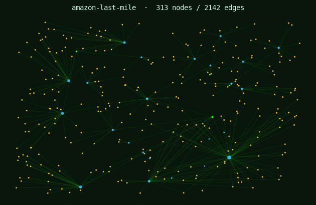<br>amazon-last-mile</a> | <a href="uber-manhattan/"><br>uber-manhattan</a> | <a href="semiconductor-supply/">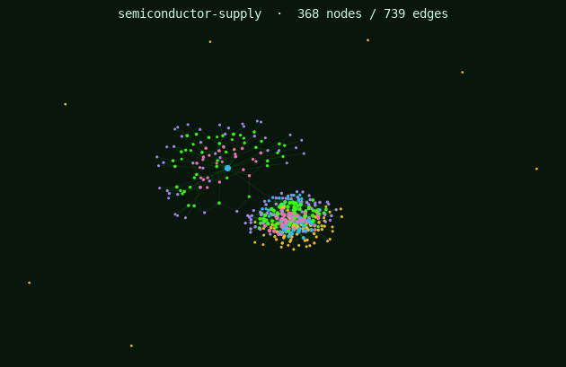<br>semiconductor-supply</a> |
| <a href="aerospace-components/">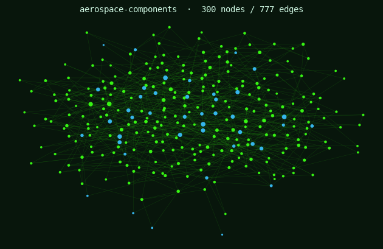<br>aerospace-components</a> | <a href="mutualaid-quake/">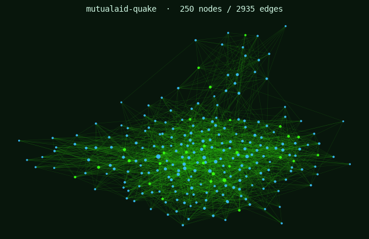<br>mutualaid-quake</a> | <a href="financial-contagion/">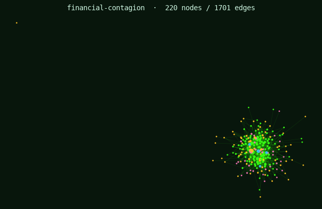<br>financial-contagion</a> |
| <a href="airline-delays/">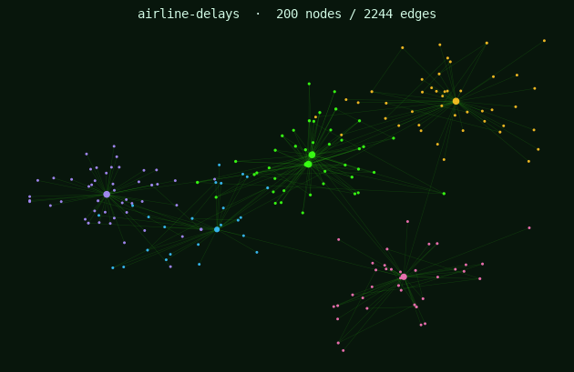<br>airline-delays</a> | <a href="power-grid/">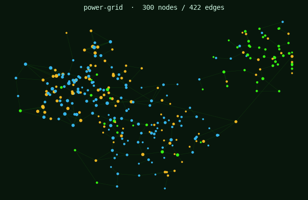<br>power-grid</a> | <a href="campus-contact/">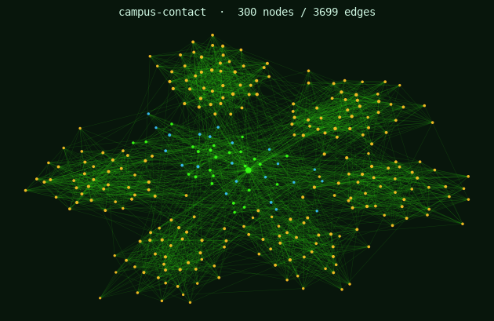<br>campus-contact</a> |
| <a href="opensource-deps/">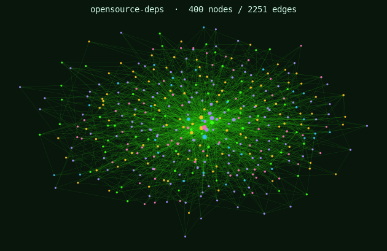<br>opensource-deps</a> | <a href="trade-commodity/">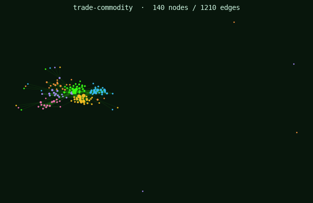<br>trade-commodity</a> | <a href="reorg-comms/"><br>reorg-comms</a> |
| <a href="satellite-constellation/">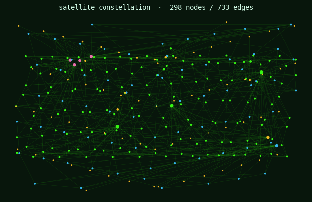<br>satellite-constellation</a> | <a href="drone-components/">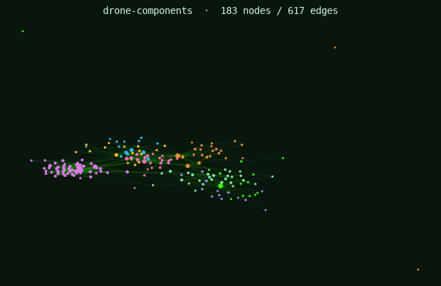<br>drone-components</a> | <a href="transit-multimodal/">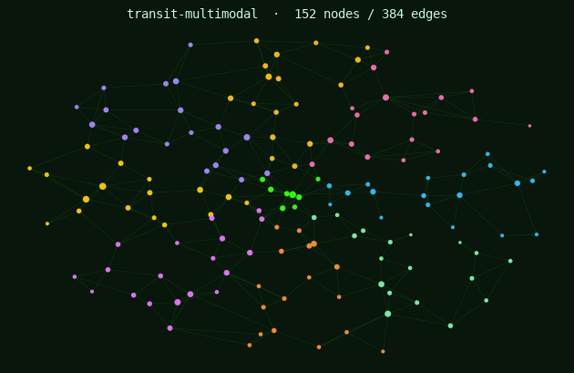<br>transit-multimodal</a> |
| <a href="satellite-supply-chain/">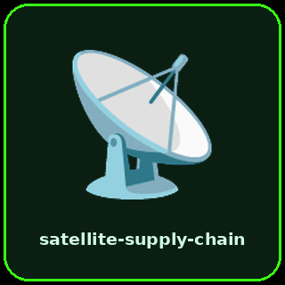<br>satellite-supply-chain</a> | <a href="aircraft-supply-chain/">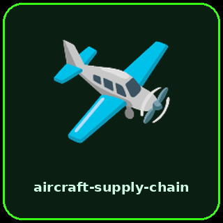<br>aircraft-supply-chain</a> | <a href="ups-ground-network/">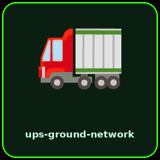<br>ups-ground-network</a> |

## How to use them

**In R**

```bash
Rscript data/projects/amazon-last-mile/load.R
```

```r
source("data/projects/amazon-last-mile/load.R")
g <- load_amazon()      # a directed, weighted igraph object
```

**In Python**

```bash
python data/projects/amazon-last-mile/load.py
```

```python
import sys; sys.path.insert(0, "data/projects/amazon-last-mile")
from load import load_amazon
g = load_amazon()       # a directed, weighted python-igraph object
```

**In the browser playground** — open the
[R](https://timothyfraser.com/netsci/playground-r.html) or
[Python](https://timothyfraser.com/netsci/playground-py.html) playground and pick
the dataset from the **▾ Load sample** menu (under *Project datasets*).

## A note on the data

Every dataset is **synthetic but not random**. Each has planted, realistic
structure — usually *several* overlapping patterns — that reward genuine analysis.
The patterns are intentionally undocumented: finding and explaining them is the
project. "Bigger places have more activity" is where you start, not where you stop.

## Reproducing / contributing

Each `_generate.py` is deterministic (fixed seed). After regenerating any dataset,
mirror the CSVs into the playground's served folder:

```bash
python data/projects/<name>/_generate.py
python data/projects/_sync_to_playground.py
```

The authoring standard (folder layout, README + codebook format, loader
templates, and the "planted story" design rules) lives in the
`netsci-dataset-builder` skill under `.claude/skills/`.
