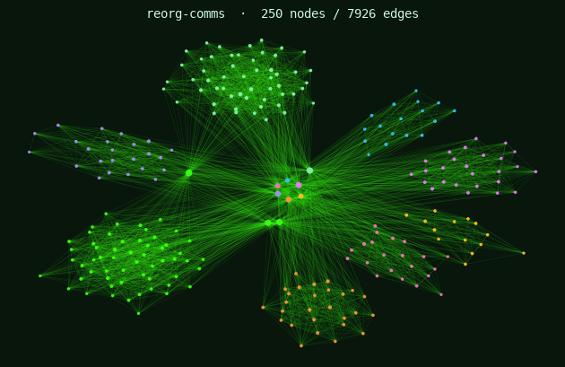

# reorg-comms

*Internal employee communication (email + chat volume) at a ~250-person company,
observed before, during, and after a reorganization and layoff.*



## At a glance

| | |
|---|---|
| **Direction** | Directed (message flow: sender → receiver) |
| **Weights** | Weighted (`message_count` per edge) |
| **Modality** | Unimodal — one node kind (`employee`) |
| **Temporal** | Yes — one row per (sender, receiver, **period**): `before` / `during` / `after` |
| **Nodes** | 250 (employees across 8 departments) |
| **Edges** | 7,926 (≈2,562 before + ≈3,511 during + ≈1,853 after) |
| **Files** | `nodes.csv`, `edges.csv`, `load.R`, `load.py`, `_generate.py` |

## What this network is

A directed, weighted communication network for a fictional company. Each
**employee** belongs to a department and sits somewhere on the formal org chart
(`level` and `manager_id`); a directed **message edge** carries a
`message_count` from a sender to a receiver. The company is observed across three
**periods** — a stable org (`before`), the middle of a reorganization and layoff
(`during`), and the settled, smaller org (`after`). The node table records each
employee's department, level, tenure, location, formal manager, and whether they
were laid off.

This is a communication, influence, and resilience network with an organizational
shock you can study as a natural experiment. Some questions to chew on:

- Does the org chart predict who actually holds communication power? Are the most
  *connected* people the same as the most *senior* people?
- Is there anyone whose departure would quietly sever communication between two
  parts of the company — and does their job title hint at that importance?
- Some people left in the layoff. Were they interchangeable, or did the company
  lose connective tissue it did not realize it had?
- Compare the three periods. Did the company talk more or less under stress? Did
  the *shape* of who-talks-to-whom change after the teams were redrawn?
- If you wanted to keep two departments talking after a reorg, who would you make
  sure to keep?

> **Note.** The interesting findings here are deliberately *not* documented.
> "Senior people send more messages" is the starting point, not a finding. Push
> past it — and remember that the formal hierarchy and the real one need not match.

## `nodes.csv`

One row per employee.

| Variable | Full name | Description | Class | Example values |
|---|---|---|---|---|
| `node_id` | Node ID | Unique employee key (`E###`). Referenced by edges and by `manager_id`. | character | `E001`, `E004`, `E250` |
| `kind` | Node kind | Node type (all employees in this network). | character | `employee` |
| `label` | Display name | Human-readable label. (`name` is avoided — python-igraph reserves it for the ID.) | character | `Emp 001`, `Emp 004` |
| `dept` | Department | Organizational unit the employee belongs to. | character | `Engineering`, `Sales`, `Finance` |
| `level` | Job level | Seniority tier on the formal hierarchy. | character | `ic`, `manager`, `director`, `vp` |
| `tenure_months` | Tenure | Months the employee has been at the company. | integer | `9`, `45`, `173` |
| `location` | Work location | Where the employee is based. | character | `HQ`, `Remote`, `EU Office`, `APAC Office` |
| `manager_id` | Manager node ID | `node_id` of the employee's formal manager (blank for department heads). | character | `E002`, `E227`, *(blank)* |
| `laid_off` | Laid off | 1 if the employee was let go in the layoff, else 0. | integer | `0`, `1` |

## `edges.csv`

One row per (sender, receiver, period). Directed; a pair can appear up to three
times (once per period).

| Variable | Full name | Description | Class | Example values |
|---|---|---|---|---|
| `sender_id` | Sender node ID | Employee who sent the messages. | character | `E001`, `E004` |
| `receiver_id` | Receiver node ID | Employee who received the messages. | character | `E004`, `E017` |
| `period` | Period | Org era: `before`, `during`, or `after` the reorganization. | character | `before`, `during`, `after` |
| `message_count` | Message count | Number of messages sent on that edge in that period (the edge weight). | integer | `1`, `2`, `41` |

## Load it

```bash
Rscript data/projects/reorg-comms/load.R     # R    (igraph)
python  data/projects/reorg-comms/load.py     # Python (python-igraph)
```

Both build a directed, weighted `igraph` graph and print a one-screen summary. In
the [R](https://timothyfraser.com/netsci/playground-r.html) or
[Python](https://timothyfraser.com/netsci/playground-py.html) playground, pick
**reorg-comms** from the *Load sample* menu.

## Get this data

Browse or download from the course repo:
<https://github.com/timothyfraser/netsci/tree/main/data/projects/reorg-comms>
