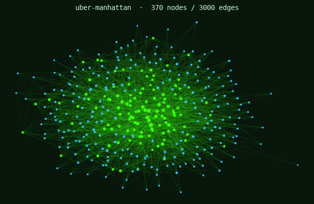

# uber-manhattan

*One day of ride-matching in downtown Manhattan: which drivers got matched to
which riders, where they were picked up and dropped off, and what each ride cost.*



## At a glance

| | |
|---|---|
| **Direction** | Undirected matches (a ride links a driver and a rider) |
| **Weights** | Weighted (`fare`, `tip`, `wait_min`, `surge_mult`; also count of repeat rides) |
| **Modality** | Bipartite — two node kinds (`driver`, `rider`); `zones.csv` is a lookup table |
| **Temporal** | Yes — each ride has an `hour` (0–23) |
| **Nodes** | 370 (120 drivers + 250 riders) |
| **Edges** | 3,000 rides (driver–rider pairs may repeat → parallel edges) |
| **Files** | `nodes.csv`, `edges.csv`, `zones.csv`, `load.R`, `load.py`, `_generate.py` |

## What this network is

A bipartite **matching** network: one side is drivers, the other is riders, and an
edge is a completed ride. Because a rider can ride with the same driver more than
once, repeated pairs appear as parallel edges. Every ride records where it started
and ended (zones on a downtown-Manhattan grid), the hour of day, how long the rider
waited, the trip distance, the fare, the surge multiplier in effect, and the tip.
The `zones.csv` lookup gives each zone a neighborhood, grid position, median income,
and a nightlife flag.

This is the natural home for **bipartite projection**, **matching/assignment**, and
**inequality** questions. Some things worth investigating:

- Project the bipartite graph onto drivers (two drivers linked if they shared a
  rider) or onto zones. What communities fall out, and what do they mean?
- Is service evenly distributed across the city? Look at wait times and match rates
  by pickup zone — is what you see explained by demand, or by *something about the
  zones*?
- Earnings are never perfectly equal, but how unequal are they here, and is the
  inequality random or structured? Who captures the most valuable trips?
- Surge pricing moves in space and time. Where and when does it spike, and does it
  change rider behavior (e.g., tipping)?
- Are there rider–driver pairs that ride together far more than chance would
  predict? What kind of trips are those?

> **Note.** The findings are deliberately undocumented. "Busy zones have more rides"
> is the starting point, not an answer. Look for the structure underneath.

## `nodes.csv`

One row per driver or rider. Driver-only columns are blank for riders and vice
versa.

| Variable | Full name | Description | Class | Example values |
|---|---|---|---|---|
| `node_id` | Node ID | Unique key. `D###` driver, `R###` rider. Referenced by edges. | character | `D015`, `R012` |
| `kind` | Node kind | Which side of the bipartite graph. | character | `driver`, `rider` |
| `home_zone` | Home zone | Zone ID the actor is based in (joins to `zones.csv`). | character | `Z22`, `Z04` |
| `vehicle_type` | Vehicle type | Driver's vehicle class (blank for riders). | character | `uberx`, `xl`, `black` |
| `tenure_months` | Tenure (months) | How long the driver has been active (blank for riders). | integer | `75`, `13` |
| `rating` | Star rating | Average rating, 1–5 (present for both sides). | double | `5.0`, `4.9` |
| `income_bracket` | Income bracket | Rider's income band (blank for drivers). | character | `low`, `mid`, `high` |

## `edges.csv`

One row per ride. Undirected match between `driver_id` and `rider_id`.

| Variable | Full name | Description | Class | Example values |
|---|---|---|---|---|
| `driver_id` | Driver ID | The driver on this ride (joins to `nodes.csv`). | character | `D015` |
| `rider_id` | Rider ID | The rider on this ride (joins to `nodes.csv`). | character | `R012` |
| `hour` | Hour of day | Local start hour, 0–23. | integer | `8`, `18`, `22` |
| `pickup_zone` | Pickup zone | Zone the ride began in (joins to `zones.csv`; `ZJFK` = airport). | character | `Z23`, `ZJFK` |
| `dropoff_zone` | Dropoff zone | Zone the ride ended in. | character | `Z04`, `ZJFK` |
| `wait_min` | Wait (minutes) | Minutes the rider waited for pickup. | double | `4.7`, `8.9` |
| `distance_km` | Distance | Trip distance, kilometers. | double | `6.92`, `21.4` |
| `fare` | Fare | Trip fare in USD (the primary edge weight). | double | `16.03`, `48.20` |
| `surge_mult` | Surge multiplier | Dynamic-pricing multiplier in effect (1.0 = no surge). | double | `1.0`, `1.9` |
| `tip` | Tip | Tip in USD. | double | `4.61`, `0.0` |

## `zones.csv`

Lookup table for the downtown-Manhattan zone grid (one row per zone). Not a node
list — join it onto the `home_zone` / `pickup_zone` / `dropoff_zone` fields.

| Variable | Full name | Description | Class | Example values |
|---|---|---|---|---|
| `zone_id` | Zone ID | Unique zone key. `ZJFK` is the airport pseudo-zone. | character | `Z01`, `ZJFK` |
| `name` | Zone name | Short label. | character | `FiDi`, `SoHo` |
| `neighborhood` | Neighborhood | Full neighborhood name. | character | `Financial District`, `SoHo` |
| `avenue` | Avenue index | West→east grid column. | integer | `3`, `1` |
| `street` | Street index | South→north grid row. | integer | `1`, `8` |
| `x` | X coordinate | Map x (≈ avenue, jittered). | double | `2.88`, `0.77` |
| `y` | Y coordinate | Map y (≈ street, jittered). | double | `1.09`, `0.84` |
| `median_income` | Median household income | Zone median income, USD (blank for the airport). | integer | `156437`, `41220` |
| `nightlife` | Nightlife flag | 1 if a nightlife district, else 0. | integer | `0`, `1` |

## Load it

```bash
Rscript data/projects/uber-manhattan/load.R     # R    (igraph, bipartite)
python  data/projects/uber-manhattan/load.py     # Python (python-igraph, bipartite)
```

Both build a bipartite, weighted `igraph` graph (vertex `type`: rider = TRUE) and
print a one-screen summary. In the
[R](https://timothyfraser.com/netsci/playground-r.html) or
[Python](https://timothyfraser.com/netsci/playground-py.html) playground, pick
**uber-manhattan** from the *Load sample* menu.

## Get this data

Browse or download from the course repo:
<https://github.com/timothyfraser/netsci/tree/main/data/projects/uber-manhattan>
